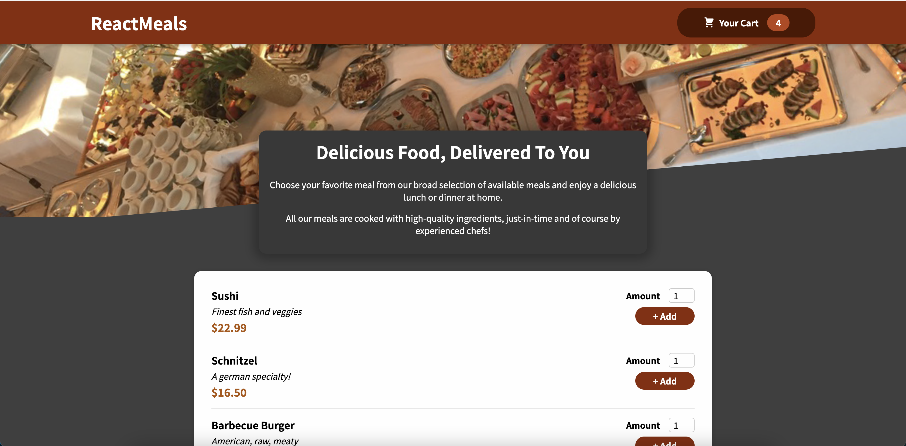

# Food order app

### This food ordering app adds items into cart. User can view added cart items in modal popup, can add or remove items from cart. Based on amount total value of item and overall value of cart changes.  

## Create new React app
### https://reactjs.org/docs/create-a-new-react-app.html

`npx create-react-app my-app`  
`cd my-app`  
`npm start`  

`For just one repo:`

`git config user.name "Your Name Here"`
`git config user.email your@email.com`
`For (global) default email (which is configured in your ~/.gitconfig):`

`git config --global user.name "Your Name Here"`
`git config --global user.email your@email.com`
